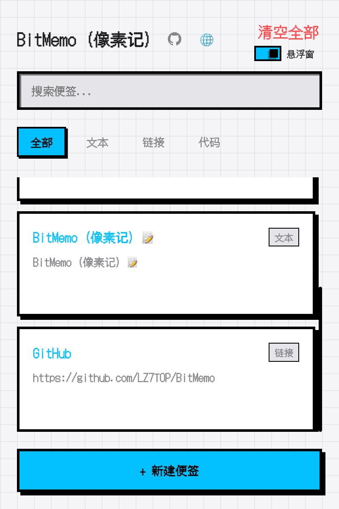
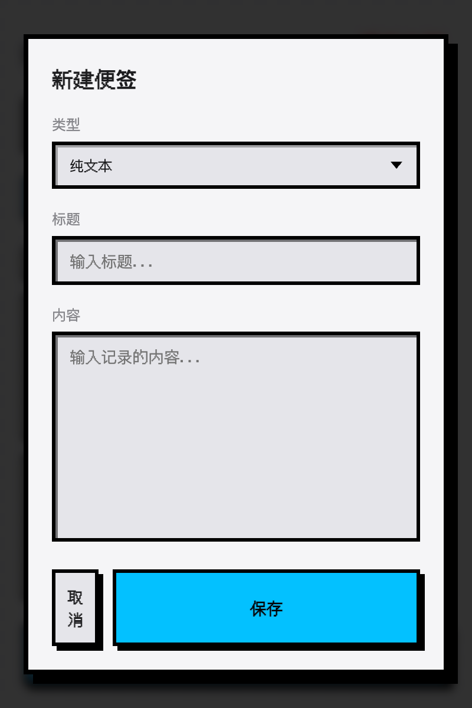
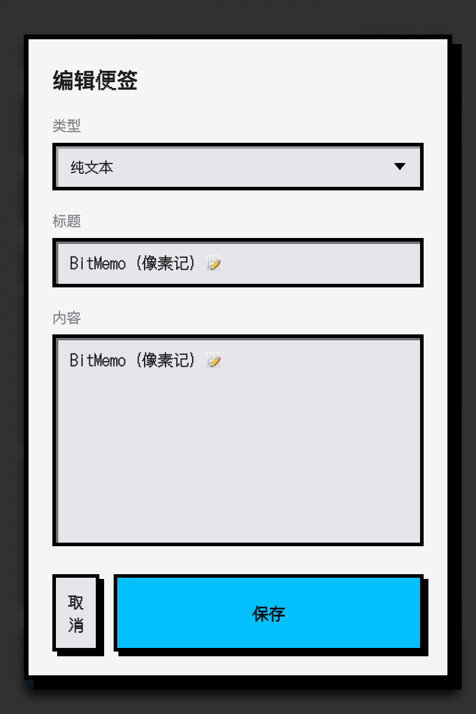
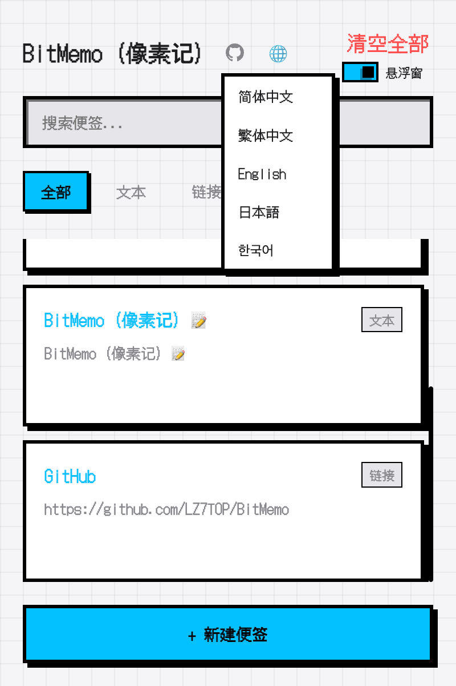
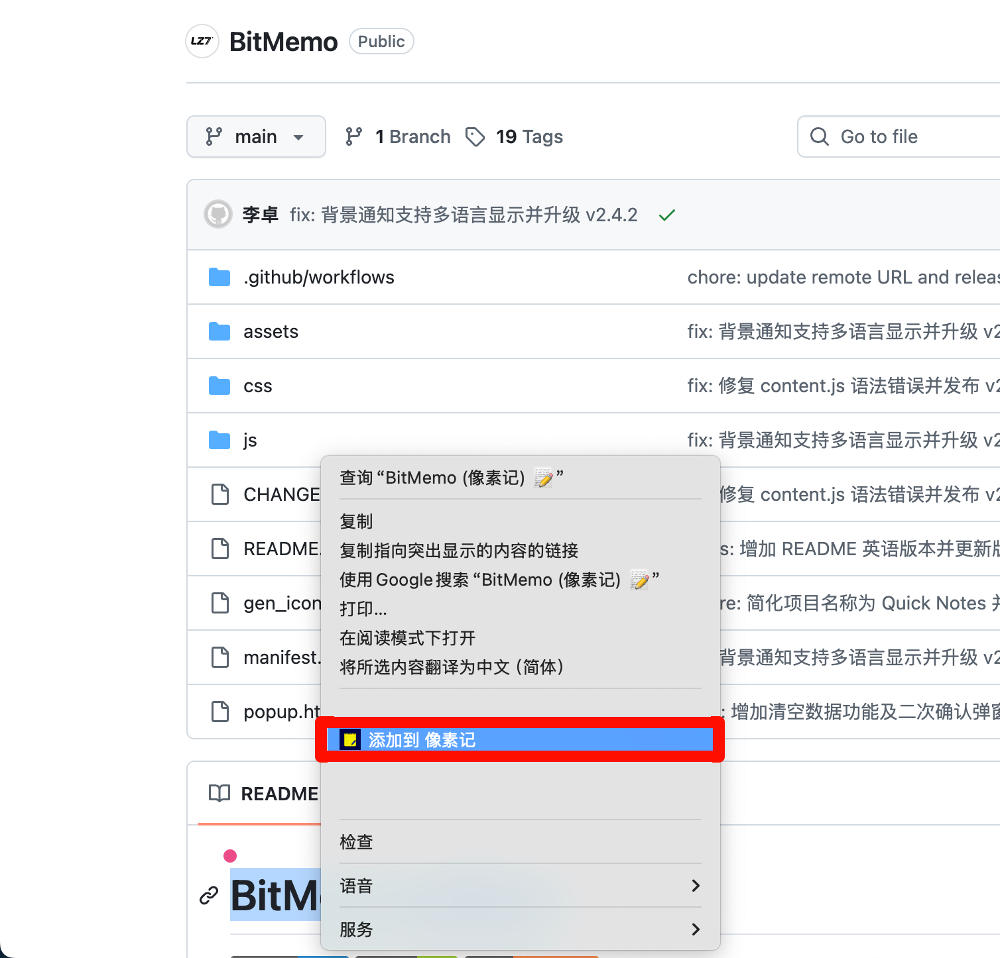
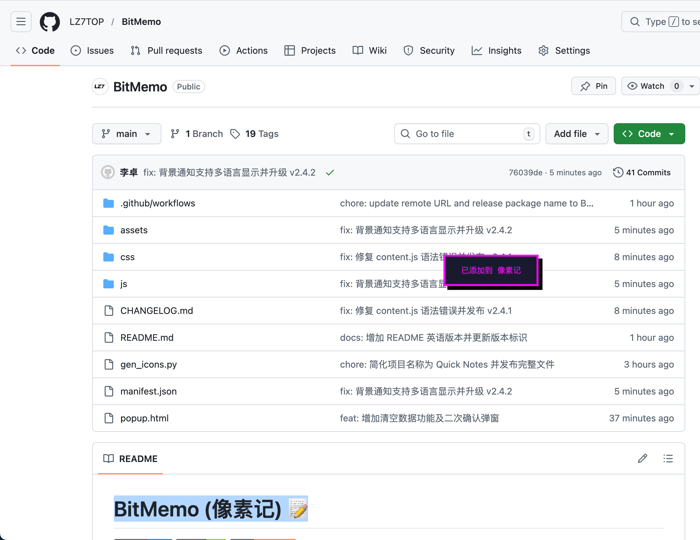

# BitMemo (像素记) 📝

[中文](#中文) | [English](#english)

---

## 中文

**BitMemo (像素记)** 是一款极具复古 8-bit 像素画风的浏览器便签扩展。它以“轻量、灵动、极客”为核心，为你提供一个随处可见、一触即发的灵感捕捉工具。

### ✨ 核心特性

- **像素美学 (Pixel Style)**：全界面采用经典的 8-bit 复古画风，硬核投影与粗边框，带你重回极客时代。
- **🌍 全面多语言支持**：完美支持 **简体中文、繁体中文、英语、日语、韩语**。所有交互界面与反馈提示均已深度本地化。
- **🖱️ 右键快捷采集**：在网页中选中文字或右键链接，即可通过 **“添加到 像素记”** 将灵感瞬间归档，并获得沉浸式像素反馈。
- **🧠 智能类型检测**：自动识别记录内容是 **文本**、**链接** 还是 **代码片段**。手动输入时也会根据内容实时自动切换分类。
- **📍 来源追踪**：清晰标注每条记录的来源（手动输入 / 右键采集），管理更高效。
- **智能悬浮 (Floating Widget)**：页面侧边的小圆点是你的灵感入口。支持拖拽定位，双击即可展开面板。
- **多端实时同步**：浏览器主弹窗与网页悬浮窗之间数据即时同步，无缝衔接。
- **自适应主题**：完美支持系统级的深色 (Dark) 与浅色 (Light) 模式切换。

### 🚀 快速开始

1. 下载并解压本项目。
2. 打开 Chrome 浏览器，进入 `chrome://extensions/`。
3. 开启右上角的“开发者模式”。
4. 点击“加载已解解压的扩展程序”，选择本项目文件夹即可。

---

## English

**BitMemo** is a browser extension for quick notes featuring a retro 8-bit pixel art style. Centered around "Lightweight, Dynamic, and Geeky" values, it provides you with an ever-present tool to capture inspirations instantly.

### ✨ Key Features

- **Pixelized Aesthetics**: Classic 8-bit retro style with hard shadows and thick borders.
- **🌍 Full Multilingual Support**: Deep localization for **Simplified Chinese, Traditional Chinese, English, Japanese, and Korean**.
- **🖱️ Context Menu Capture**: Right-click selected text or links to add them to BitMemo instantly with a cool pixel-art toast notification.
- **🧠 Smart Type Detection**: Automatically categorizes your notes into **Text**, **Link**, or **Code Snippets**. Real-time auto-switching during manual entry.
- **📍 Source Attribution**: Tracks whether a note was added **Manually** or via **Context Menu** for better organization.
- **Floating Widget**: A small draggable bubble on web pages for instant access. Double-click to expand/collapse.
- **Real-time Sync**: Instant data synchronization between the extension popup and the in-page widget.
- **Adaptive Theme**: Fully supports system-level Dark and Light mode switching.

### 🚀 Quick Start

1. Download and extract this repository.
2. Open Chrome and navigate to `chrome://extensions/`.
3. Enable "Developer mode" in the top right corner.
4. Click "Load unpacked" and select the project folder.

---

## 📸 截图展示 | Screenshots

| 主页面 | 创建与智能识别 | 编辑与复制 |
| :---: | :---: | :---: |
|  |  |  |

| 多语言切换 | 右键快捷采集 | 采集成功反馈 |
| :---: | :---: | :---: |
|  |  |  |

---

## 🗓️ 更新日志 | Changelog

详见 [CHANGELOG.md](./CHANGELOG.md)

## 📄 开源协议 | License

本项目采用 [MIT License](./LICENSE) 协议。

---

由 **LZ7** 倾情打造 | Crafted with ❤️ by **LZ7**.
